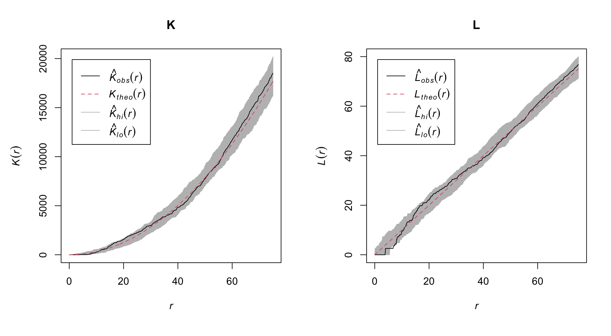

<!-- README.md is generated from README.Rmd. Please edit that file -->


[](https://www.rdocumentation.org/packages/ForestGapR)


ForestGapR: An R Package for Airborne Laser Scanning-derived Tropical
Forest Gaps Analysis

Authors: Carlos Alberto, Ekena Rangel, Midhun Mohan, Danilo Roberti
Alves de Almeida, Eben North Broadbent, Wan Shafrina Wan Mohd Jaafar,
Adrian Cardil, Ruben Valbuena, Toby Jackson, Carine Klauberg, Caio
Hamamura and Lucy Beese.

The GapForestR package provides functions to i) automate canopy gaps
detection, ii) compute a series of forest canopy gap statistics,
including gap-size frequency distributions and spatial distribution,
iii) map gap dynamics (when multi-temporal ALS data are available), and
iv) convert the data among spatial formats.

## Installation

development / GitHub version:

``` r
install.packages("remotes") 
remotes::install_github("carlos-alberto-silva/ForestGapR")
```

CRAN version:

``` r
install.packages("ForestGapR")
```

## Getting Started

``` r
library(ForestGapR)
```

### Forest Canopy Gap Detection

``` r
# Loading terra and viridis library
library(terra)
#> terra 1.7.65
library(viridis)
#> Loading required package: viridisLite

# ALS-derived CHM over Adolpho Ducke Forest Reserve - Brazilian tropical forest
ALS_CHM_DUC <- rast(system.file("tif/ALS_CHM_DUC.tif", package = "ForestGapR"))

# Plotting chm
plot(ALS_CHM_DUC, col = viridis(10))

# Setting height thresholds (e.g. 10 meters)
threshold <- 10
size <- c(1, 1000) # m2

# Detecting forest gaps
gaps_duc <- getForestGaps(chm_layer = ALS_CHM_DUC, threshold = threshold, size = size)

# Plotting gaps
plot(gaps_duc, col = "red", add = TRUE, legend = FALSE)
title("Forest Canopy Gap", line = 3)
```


### Forest Canopy Gaps Stats

This function computes a series of forest canopy gap statistics

List of forest gaps statistics:

- `gap_id`: gap id;
- `gap_area`: area of gap (m<sup>2</sup>);
- `chm_max`: Maximum canopy height (m) within gap boundary;
- `chm_min`: Minimum canopy height (m) within gap boundary;
- `chm_mean`: Mean canopy height (m) within gap boundary;
- `chm_sd`: Standard Deviation of canopy height (m) within gap boundary;
- `chm_range`: Range of canopy height (m) within gap boundary

``` r
# Loading terra library
library(terra)

# ALS-derived CHM over Adolpho Ducke Forest Reserve - Brazilian tropical forest
ALS_CHM_DUC <- rast(system.file("tif/ALS_CHM_DUC.tif", package = "ForestGapR"))

# Setting height thresholds (e.g. 10 meters)
threshold <- 10
size <- c(5, 1000) # m2

# Detecting forest gaps
gaps_duc <- getForestGaps(chm_layer = ALS_CHM_DUC, threshold = threshold, size = size)

# Computing basic statistis of forest gap
gaps_stats <- GapStats(gap_layer = gaps_duc, chm_layer = ALS_CHM_DUC)

head(gaps_stats)
#>   gap_id gap_area chm_max chm_min chm_mean chm_sd chm_gini chm_range
#> 1      1       34    9.22    1.09     5.12   2.61     0.30      8.13
#> 2      2        6    8.17    6.06     7.40   0.74     0.06      2.11
#> 3      3        5    9.96    7.42     8.85   1.23     0.08      2.54
#> 4      4       32    9.91    4.42     8.12   1.69     0.12      5.49
#> 5      5       11    9.83    6.23     8.48   1.09     0.07      3.60
#> 6      6       44    9.72    1.92     7.31   1.60     0.12      7.80
```

### Forest Canopy Gap-size Frequency Distributions

``` r
# Loading terra library
library(terra)

# ALS-derived CHM over Adolpho Ducke Forest Reserve - Brazilian tropical forest
ALS_CHM_DUC <- rast(system.file("tif/ALS_CHM_DUC.tif", package = "ForestGapR"))

# set height thresholds (e.g. 10 meters)
threshold <- 10
size <- c(1, 1000) # m2

# Detecting forest gaps
gaps_duc <- getForestGaps(chm_layer = ALS_CHM_DUC, threshold = threshold, size = size)

# Computing basic statistis of forest gap
gaps_stats <- GapStats(gap_layer = gaps_duc, chm_layer = ALS_CHM_DUC)

# Gap-size Frequency Distributions
GapSizeFDist(
  gaps_stats = gaps_stats, method = "Hanel_2017",
  col = "forestgreen", pch = 16, cex = 1.25, ann = FALSE, axes = FALSE
)
#> Warning in xy.coords(x, y, xlabel, ylabel, log): 41 y values <= 0 omitted from
#> logarithmic plot
title(
  "Forest Canopy Gap-size Frequency Distributions",
  ylab = "Gap Frequency",
  xlab = as.expression(bquote("Gap Size" ~ (m^2)))
)
at <- c(1:5, (1:5) * 10)
sapply(1:2, axis, at = at, las = 2)
abline(h = at, v = at, lty = 3, lwd = 0.35)
```


### Forest Canopy Gaps as Spatial Polygons

``` r
# Loading terra and viridis libraries
library(terra)
library(viridis)

# ALS-derived CHM over Adolpho Ducke Forest Reserve - Brazilian tropical forest
ALS_CHM_DUC <- rast(system.file("tif/ALS_CHM_DUC.tif", package = "ForestGapR"))

# set height thresholds (e.g. 10 meters)
threshold <- 10
size <- c(4, 1000) # m2

# Detecting forest gaps
gaps_duc <- getForestGaps(chm_layer = ALS_CHM_DUC, threshold = threshold, size = size)

# Converting SpatRaster layer to SpatialPolygonsDataFrame
gaps_spdf <- GapSPDF(gap_layer = gaps_duc)

# Plotting ALS-derived CHM and forest gaps
plot(ALS_CHM_DUC, col = viridis(10), xlim = c(173025, 173125), ylim = c(9673100, 9673200))
plot(gaps_spdf, add = TRUE, border = "red", lwd = 2)
```


``` r
# Populating the attribute table of Gaps_spdf with gaps statistics
gaps_stats <- GapStats(gap_layer = gaps_duc, chm_layer = ALS_CHM_DUC)
gaps_spdf <- merge(gaps_spdf, gaps_stats, by = "gap_id")
head(gaps_spdf@data)
#>   gap_id        x       y gap_area chm_max chm_min chm_mean chm_sd chm_gini
#> 1      1 173088.7 9673197       34    9.22    1.09     5.12   2.61     0.30
#> 2      2 173103.7 9673195        6    8.17    6.06     7.40   0.74     0.06
#> 3      3 173036.3 9673192        5    9.96    7.42     8.85   1.23     0.08
#> 4      4 173109.3 9673185       32    9.91    4.42     8.12   1.69     0.12
#> 5      5 173100.0 9673188       11    9.83    6.23     8.48   1.09     0.07
#> 6      6 173050.8 9673158       44    9.72    1.92     7.31   1.60     0.12
#>   chm_range
#> 1      8.13
#> 2      2.11
#> 3      2.54
#> 4      5.49
#> 5      3.60
#> 6      7.80
```

### Forest Gap Change Detection

``` r
# Loading terra and viridis libraries
library(terra)
library(viridis)

# ALS-derived CHM from Fazenda Cauxi - Brazilian tropical forest
ALS_CHM_CAU_2012 <- rast(system.file("tif/ALS_CHM_CAU_2012.tif", package = "ForestGapR"))
ALS_CHM_CAU_2014 <- rast(system.file("tif/ALS_CHM_CAU_2014.tif", package = "ForestGapR"))

# set height thresholds (e.g. 10 meters)
threshold <- 10
size <- c(1, 1000) # m2

# Detecting forest gaps
gaps_cau2012 <- getForestGaps(chm_layer = ALS_CHM_CAU_2012, threshold = threshold, size = size)
gaps_cau2014 <- getForestGaps(chm_layer = ALS_CHM_CAU_2014, threshold = threshold, size = size)

# Detecting forest gaps changes
Gap_changes <- GapChangeDec(gap_layer1 = gaps_cau2012, gap_layer2 = gaps_cau2014)

# Plotting ALS-derived CHM and forest gaps
par(mfrow = c(1, 3))
plot(ALS_CHM_CAU_2012, main = "Forest Canopy Gap - 2012", col = viridis(10))
plot(gaps_cau2012, add = TRUE, col = "red", legend = FALSE)

plot(ALS_CHM_CAU_2014, main = "Forest Canopy Gap - 2014", col = viridis(10))
plot(gaps_cau2014, add = TRUE, col = "red", legend = FALSE)

plot(ALS_CHM_CAU_2014, main = "Forest Gaps Changes Detection", col = viridis(10))
plot(Gap_changes, add = TRUE, col = "orange", legend = FALSE)
```


### Spatial Pattern of Forest Canopy Gaps

``` r
# Loading terra and viridis libraries
library(terra)
library(viridis)

# ALS-derived CHM from Fazenda Cauxi - Brazilian tropical forest
ALS_CHM_CAU_2012 <- rast(system.file("tif/ALS_CHM_CAU_2012.tif", package = "ForestGapR"))
ALS_CHM_CAU_2014 <- rast(system.file("tif/ALS_CHM_CAU_2014.tif", package = "ForestGapR"))

# set height thresholds (e.g. 10 meters)
threshold <- 10
size <- c(1, 1000) # m2

# Detecting forest gaps
gaps_cau2012 <- getForestGaps(chm_layer = ALS_CHM_CAU_2012, threshold = threshold, size = size)
gaps_cau2014 <- getForestGaps(chm_layer = ALS_CHM_CAU_2014, threshold = threshold, size = size)

# Converting raster layers to SpatialPolygonsDataFrame
gaps_cau2012_spdf <- GapSPDF(gap_layer = gaps_cau2012)
gaps_cau2014_spdf <- GapSPDF(gap_layer = gaps_cau2014)

# Spatial pattern analysis of each year
gaps_cau2012_SpatPattern <- GapsSpatPattern(gaps_cau2012_spdf, ALS_CHM_CAU_2012)
gaps_cau2014_SpatPattern <- GapsSpatPattern(gaps_cau2014_spdf, ALS_CHM_CAU_2014)
```

> Spatial Pattern in 2012

      
        Clark-Evans test
        Donnelly correction
        Z-test
      
      data:  P
      R = 0.87137, p-value = 4.932e-05
      alternative hypothesis: two-sided


> Spatial Pattern in 2014

      
        Clark-Evans test
        Donnelly correction
        Z-test
      
      data:  P
      R = 1.0131, p-value = 0.7993
      alternative hypothesis: two-sided



### References

Silva, C.A., Pinage,E., Mohan, M., Valbuena, R., Almeida, D.,
Broadbent,E., Jaafar, W., Papa, D., Cardil, A., Klauberg, C.2019.
ForestGapR: An R Package for Airborne Laser Scanning-derived Tropical
Forest Gaps Analysis. Methods Ecol Evolution. 10, 1347-1356
<https://doi.org/10.1111/2041-210X.13211>

Hanel,R., Corominas-Murtra, B., Liu, B., Thurner, S. Fitting power-laws
in empirical data with estimators that work for all exponents,PloS one,
vol. 12, no. 2, p. e0170920,
2017.https://doi.org/10.1371/journal.pone.0170920

Asner, G.P., Kellner, J.R., Kennedy-Bowdoin, T., Knapp, D.E., Anderson,
C. & Martin, R.E. 2013. Forest canopy gap distributions in the Southern
Peruvian Amazon. PLoS One, 8, e60875.
<https://doi.org/10.1371/journal.pone.0060875>

White, E.P, Enquist, B.J, Green, J.L. (2008) On estimating the exponent
of powerlaw frequency distributions. Ecology 89,905-912.
<https://doi.org/10.1890/07-1288.1>

Sustainable Landscape Brazil. 2018.
<https://www.paisagenslidar.cnptia.embrapa.br/webgis/>. (accessed in
August 2018).

### Acknowledgements

ALS data from Adolfo Ducke (ALS_CHM_DUC) Forest Reserve and Cauaxi
Forest (ALS_CHM_CAU_2012 and ALS_CHM_CAU_2014) used as exemple datasets
were acquired by the Sustainable Landscapes Brazil project supported by
the Brazilian Agricultural Research Corporation (EMBRAPA), the US Forest
Service, USAID, and the US Department of State.
